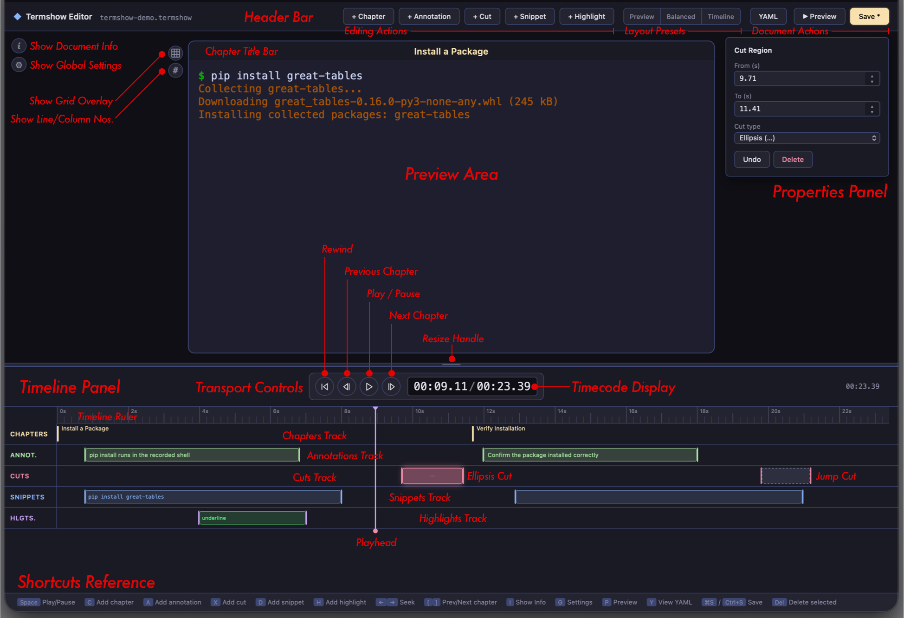

# Terminal Recordings

Great Docs includes **Termshow**, a complete solution for recording, editing, and presenting
terminal sessions in your documentation. A Termshow recording captures everything you type and see
in a terminal with precise timing, stores it in a lightweight format, and renders it as an
interactive player on your site.

Unlike video files or animated GIFs, Termshow recordings render as crisp SVGs at any zoom level,
require no external hosting, and work offline. The full pipeline lives inside Great Docs: record,
annotate, and embed with a single shortcode. For annotation, you can either edit the YAML script
file directly or use the **Termshow Editor**, a browser-based visual editor that lets you add
chapters, annotations, and cuts by dragging and clicking rather than writing timestamps by hand.

Here's what a Termshow recording looks like in action. This one shows a typical workflow:
installing a package and verifying it:



The player above is paused at each chapter boundary, waiting for you to press play. This is the
recommended presentation mode for tutorials: each chapter represents one logical step, giving
readers time to absorb what happened before moving on. Click the play button (or press Space) to
advance through each chapter at your own pace.

The two chapters in this demo correspond to the two stages of the workflow: installing the
package and verifying the result. You define chapters in a companion YAML file, and the player
renders gold markers on the timeline at each boundary.

## Quick Start

### 1. Record a session

Save recordings in your project's `assets/` directory, which is automatically
available to the `` shortcode at build time.

```bash
great-docs termshow record assets/install-guide.termshow
```

This launches a recording session in your terminal. Everything you type and see is captured with
precise timing. Press `Ctrl+D` or type `exit` to end.

During the session, you will see status messages confirming the recording is active:

```
Recording... (cols=80, rows=24)
Press Ctrl+D or type 'exit' to stop.
```

These messages are for your benefit only. They are automatically stripped from the saved file so
viewers never see recorder diagnostics in the final output.

The command creates two files:

- `assets/install-guide.termshow`: the raw recording
- `assets/install-guide.termshow.yml`: a script template with commented sections

With the raw recording saved and the script template in place, you're ready to shape the
presentation.

### 2. Edit the script file

Open `assets/install-guide.termshow.yml` and uncomment/fill in the sections you need (or use the
Termshow Editor with `great-docs termshow edit assets/install-guide.termshow`):

```yaml
source: assets/install-guide.termshow

settings:
  idle_time_limit: 2.0
  window_chrome: colorful

chapters:
  - at: 0.0
    label: Setup
  - at: 8.0
    label: Install
  - at: 15.0
    label: Verify

annotations:
  - at: 1.0
    duration: 3.0
    text: Start by activating the virtual environment
    position: top-right
    style: callout
```

### 3. Embed in a page

```{shortcodes="false"}

```

That single line is all you need. The shortcode handles discovery, rendering, and embedding
automatically during the build step.

### 4. Build

```bash
great-docs build
```

During the build, Great Docs automatically finds all `.termshow` files, renders them into SVG
keyframes, and embeds the data inline in your HTML pages. No runtime fetches are needed.

That's the entire workflow: record, annotate, embed, and build. The following sections cover each
piece in detail.

## The Recording Format

### `.termshow` files

The raw recording is stored as NDJSON (newline-delimited JSON). The first line is a header with
terminal metadata; subsequent lines are events:

```json
{"version": 1, "format": "termshow", "term": {"cols": 80, "rows": 20}, "title": "My Demo"}
[0.5, "o", "$ "]
[0.1, "o", "echo hello"]
[0.6, "o", "\r\nhello\r\n"]
[1.0, "m", "Step complete"]
```

Each event is `[delay_seconds, type, data]`:

| Type | Meaning |
|------|---------|
| `"o"` | Output: data written to the terminal |
| `"i"` | Input: user keystrokes (for display) |
| `"m"` | Marker: internal sync point for chapters |

You rarely need to edit `.termshow` files by hand. The recorder and importer produce them, and
the script file controls how they are presented.

### `.termshow.yml` script files

The companion YAML file adds chapters, annotations, visual settings, and edits:

```yaml
source: assets/my-recording.termshow

settings:
  idle_time_limit: 2.0        # Cap idle gaps to 2 seconds
  window_chrome: colorful     # Window decoration style
  theme: monokai              # Terminal color scheme
  font_size: 14               # Font size in rendered SVG (px)
  line_height: 1.2            # Line height multiplier
  padding: 12                 # Inner padding (px)

chapters:
  - at: 0.0
    label: Introduction
  - at: 5.0
    label: Configuration
  - at: 12.0
    label: Running Tests

annotations:
  - at: 1.0
    duration: 3.0
    text: This installs all required dependencies
    position: top-right
    style: callout
  - at: 6.0
    duration: 2.5
    text: Configuration is auto-detected
    position: bottom-right
    style: subtle

cuts:
  - from: 8.0
    to: 11.0
    type: ellipsis
```

All fields are optional except `source`. Start with just chapters and add annotations or cuts as
you refine the presentation.

## Settings Reference

The `settings` block in your `.termshow.yml` controls how the recording is rendered into SVG
frames. All settings are optional and have sensible defaults.

| Setting | Default | Description |
|---------|---------|-------------|
| `idle_time_limit` | `3.0` | Maximum seconds for any idle gap |
| `window_chrome` | `colorful` | Window decoration: `colorful`, `plain`, `none` |
| `theme` | (auto) | Terminal color scheme |
| `font_size` | `14` | Font size in rendered SVG (px) |
| `line_height` | `1.2` | Line height multiplier |
| `padding` | `12` | Inner padding of the terminal area (px) |

These settings are applied at render time. Changing them requires re-rendering but not
re-recording.

## Shortcode Reference

Embed a Termshow recording in any page with the `termshow` shortcode. At its simplest, you only
need the `file` path:

```{shortcodes="false"}

```

### Options

The shortcode accepts the following options to control player behavior:

| Option | Default | Description |
|--------|---------|-------------|
| `file` | *(required)* | Path to the `.termshow` file (without extension) |
| `autoplay` | `"false"` | Start playing automatically on page load |
| `loop` | `"false"` | Loop playback when reaching the end |
| `speed` | `"1"` | Initial playback speed multiplier |
| `pause_on_chapters` | `"false"` | Auto-pause at each chapter boundary |
| `controls` | `"true"` | Show the control bar |
| `theme` | `"auto"` | Player theme: `auto`, `dark`, or `light` |

All options are specified as key-value attributes on the shortcode. Unrecognized options are
silently ignored, so you can safely add new ones as they become available.

### Examples

Basic embed:

```{shortcodes="false"}

```

Chapter-pausing tutorial:

```{shortcodes="false"}

```

Fast autoplay preview:

```{shortcodes="false"}

```

Combine options freely. For instance, `autoplay` with `loop` creates a continuously cycling
demonstration, while `pause_on_chapters` with `speed="1.5"` produces a brisk but controlled
tutorial.

## Player Controls

The embedded player provides interactive controls for navigating recordings. Here's what each
component does:

### Control Bar

The bottom control bar contains (left to right):

1. **Play / Pause / Replay**: Toggles playback. Shows ↺ at the end of the recording.
2. **Elapsed time**: Current playback position.
3. **Timeline**: Click anywhere to seek. Gold chapter markers indicate chapter boundaries;
   their hit targets are wider than the visible marks for easy clicking.
4. **Remaining time**: Counts down to zero during playback.
5. **Speed**: Cycles through 0.5×, 1×, 1.5×, 2×, 3×.

All controls are keyboard-accessible and respond to the shortcuts listed below.

### Chapter Bar

A semi-transparent overlay at the top of the player displays the current chapter name. It updates
as playback progresses and when pausing at chapter boundaries.

### Center Overlay

A large semi-transparent button appears in the center of the viewport:

- **Before playback**: Shows ▶ as a play call-to-action.
- **After playback ends**: Shows ↺. Clicking it returns the player to its initial state (frame 0)
  without auto-playing.
- **During chapter pauses**: Hidden, so the terminal content remains fully visible for reading.

The overlay never obscures content during active playback; it only appears when the player is
waiting for user input.

### Keyboard Shortcuts

Click the player viewport to give it focus, then use:

| Key | Action |
|-----|--------|
| `Space` | Play / Pause (or reset from ended state) |
| `→` | Seek forward 5 seconds |
| `←` | Seek backward 5 seconds |
| `]` | Jump to next chapter |
| `[` | Jump to previous chapter |

All shortcuts require the player to have focus. Click anywhere on the player viewport first.

## Chapters

Chapters divide a recording into labeled sections. They appear as gold markers on the timeline and
enable `pause_on_chapters` mode for step-by-step tutorials.

```yaml
chapters:
  - at: 0.0
    label: Introduction
  - at: 5.0
    label: Installation
  - at: 12.0
    label: Configuration
```

The `at` field is the timestamp in seconds. The `label` is shown in the chapter bar and as a
tooltip on the timeline marker.

**Tips:**

- Place chapters at logical transitions. Each should represent one distinct step.
- The first chapter at `0.0` names what's on screen before the viewer presses play.
- Use `pause_on_chapters="true"` for tutorials where readers need time to absorb each step.

## Annotations

Annotations are contextual overlays that appear at specific timestamps to explain what's happening
in the terminal:

```yaml
annotations:
  - at: 2.0
    duration: 3.0
    text: This installs all dependencies from requirements.txt
    position: top-right
    style: callout
    width: medium
```

Annotations are purely presentational: they don't affect timing or terminal output, and you can
add or remove them at any point without re-recording.

### Styles

Each annotation has a `style` that controls its visual weight:

| Style | Appearance |
|-------|------------|
| `callout` | Dark semi-opaque card with accent border: draws focus |
| `subtle` | Lighter, smaller text: less intrusive |
| `highlight` | Amber-tinted with warm border: strong emphasis |

Choose the style that matches the annotation's importance. Most recordings need only `callout`
and `subtle`; reserve `highlight` for critical warnings or pivotal steps.

### Positions

Annotations can be placed at any edge or corner of the terminal viewport:

| Position | Placement |
|----------|-----------|
| `top-left` | Top-left corner |
| `top` | Top center |
| `top-right` | Top-right corner |
| `left` | Vertically centered, left edge |
| `right` | Vertically centered, right edge |
| `bottom-left` | Bottom-left corner |
| `bottom` | Bottom center |
| `bottom-right` | Bottom-right corner (default) |

Place annotations where they won't cover the terminal text you're explaining. `top-right` is a
good default because most CLI output scrolls along the left edge.

### Width

Control how wide an annotation can grow with the `width` field:

| Width | Max width |
|-------|-----------|
| `small` | 25% of the viewport |
| `medium` | 50% of the viewport (default) |
| `large` | 75% of the viewport |

Use `small` for brief one-word labels, `large` for longer explanations that need breathing room.

**Tips:**

- Keep text to one sentence. Annotations complement the terminal output, not replace it.
- Use `callout` for important explanations, `subtle` for minor context.
- Ensure `duration` is long enough to read at 1.5× speed.

## Cuts

Remove dead time or irrelevant segments from a recording:

```yaml
cuts:
  - from: 8.0
    to: 11.0
    type: ellipsis
```

The `type` field controls what viewers see during the cut:

| Value | Effect |
|-------|--------|
| `jump` | Seamless jump (no visual indicator) |
| `ellipsis` | Shows "…" briefly to indicate skipped time |

Cuts are non-destructive: they are stored in the script file, not applied to the raw recording.
You can always remove or adjust them later.

## Snippets

Snippets let you add a **copy button** to the player that appears during a time range. When visible,
readers can click it to copy the associated text to their clipboard: no manual retyping needed.

```yaml
snippets:
  - at: 0.5
    duration: 7.0
    text: "pip install great-tables"
    label: Install
  - at: 8.0
    duration: 6.0
    match: '\$ (.+)'
    label: Verify
```

You can provide text in two ways:

- **`text`**: a literal string that gets copied verbatim
- **`match`**: a regex run against the terminal buffer at that moment; copies the first capture
group (or the full match if no group is defined)

If both are set, `match` takes priority (with `text` as fallback if the regex doesn't match).

### Fields

| Field | Default | Description |
|-------|---------|-------------|
| `at` | *(required)* | Time in seconds when the button appears |
| `duration` | `5.0` | How long the button stays visible |
| `text` | `""` | Literal text copied to the clipboard on click |
| `match` | `""` | Regex pattern matched against the visible terminal text |
| `label` | `"Copy"` | Button label shown alongside the copy icon |

At least one of `text` or `match` must be provided.

The button fades in and out smoothly, just like annotations. It appears in the **title bar** at
the far right of the player. Only one snippet button is visible at a time. If time ranges overlap,
the first one wins and subsequent ones are hidden.

**Tips:**

- Snippet time ranges **must not overlap**. The Editor enforces this; if you write overlapping
  ranges manually in YAML, only the first active snippet is shown.
- Align snippets with chapters: set `at` to the chapter start time and `duration` to the chapter
  length. This way the copy button is visible for the entire step.
- Use `text` when you know the exact string (e.g., a `pip install` invocation). Don't include
  prompts (`$`).
- Use `match` when the text is dynamic or you want to extract from what's visible. For example,
  `'\$ (.+)'` matches any shell prompt line and captures just the command. Use single quotes in
  YAML to avoid backslash escape issues.
- Use `label` to give context (e.g., "Install", "Build", "Test") so readers know what they're
  copying without reading the full snippet.
- Snippets work regardless of playback state — readers can copy while paused, playing, or at a
  chapter stop.

## Importing Existing Recordings

Already have terminal recordings from other tools? Import them:

```bash
# From asciinema (.cast files)
great-docs termshow import-cast recording.cast assets/my-demo

# From VHS (.tape files)
great-docs termshow import-tape demo.tape assets/my-demo
```

The import preserves timing and terminal dimensions. Create a `.termshow.yml` script afterward to
add chapters and annotations.

Both importers produce the same `.termshow` format, so all editing and rendering features work
identically regardless of the original source.

## Rendering & Preview

You can preview and render recordings outside of a full site build using these CLI commands:

### Preview in terminal

```bash
great-docs termshow play assets/my-demo.termshow
```

Plays the recording directly in your terminal for quick review.

### Render SVG frames manually

```bash
great-docs termshow render assets/my-demo.termshow
```

Generates the SVG keyframes and `manifest.json` without a full site build. Useful for inspecting
the output or debugging chapter timing.

Both commands work with any `.termshow` file that has a companion `.termshow.yml` script.

## Best Practices

These guidelines help produce recordings that are clear, fast-loading, and pleasant to watch:

- **Keep recordings short**: 15–30 seconds is ideal. Split longer workflows into multiple
  recordings, each embedded with its own shortcode.
- **Use `idle_time_limit`**: Caps long pauses so viewers aren't waiting through your thinking
  time.
- **80 columns, 20 rows** works well for CLI demos. Use 120 columns for wide output like log
  lines or tables. The Termshow Editor auto-scales the preview to fit any terminal size, so
  larger dimensions won't overflow the viewport.
- **Test at different speeds**: Make sure annotations are readable at 1.5× and 2×.
- **Place recordings in `assets/`**: Keep them in a dedicated directory at your project root.
  The build system discovers them automatically.

Following these guidelines ensures your recordings feel polished and load quickly, even on slower
connections.

## How It Works

The Termshow pipeline has two phases:

**Build time** (automatic during `great-docs build`):

1. Discovers all `.termshow` files in the project root
2. Parses each recording + its YAML script
3. Renders SVG keyframes at each visual change point
4. Generates `manifest.json` with timing, chapters, and annotations
5. The Quarto shortcode filter embeds the manifest and all SVGs inline as JSON

**Page load** (JavaScript, no network requests):

1. Reads inline manifest and SVG data from embedded `<script>` elements
2. Builds the player UI (viewport, controls, chapter bar, overlays)
3. On play: advances time via `requestAnimationFrame`, swaps SVG frames at correct timestamps

This architecture means zero runtime fetches, full offline support (including `file://` protocol),
and pixel-perfect SVG rendering at any zoom level.

## The Termshow Editor

The Termshow Editor is a browser-based non-linear editor (NLE) for `.termshow` recordings. It
lets you visually add, move, and fine-tune chapters, annotations, and cuts without editing YAML
by hand.

### Launching the Termshow Editor

```bash
great-docs termshow edit assets/my-demo.termshow
```

This opens a local web app at `http://127.0.0.1:8765`. The Termshow Editor loads the recording
and its companion `.termshow.yml` script file (creating one if it doesn't exist). Use `--port`
to change the port or `--no-browser` to suppress the automatic browser launch.

### Interface Layout



The Termshow Editor is divided into these primary areas:

**Header Bar.** The top bar shows the editor title and filename, along with action buttons organized into
thematic groups:

**Editing actions** (left):

- **+ Chapter**: add a chapter marker at the current playhead position (shortcut: `C`)
- **+ Annotation**: add a 2-second annotation at the playhead (shortcut: `A`)
- **+ Cut**: mark a cut region at the playhead (shortcut: `X`)
- **+ Snippet**: add a snippet at the playhead (shortcut: `D`)

**Layout presets** (center): A segmented button with three view presets that control the
split between the Preview Area and the Timeline Panel:

- **Preview**: 75/25 split: maximizes the terminal view for inspecting output
- **Balanced**: 50/50 split: equal space for preview and timeline (default)
- **Timeline**: 25/75 split: maximizes the timeline for detailed editing

**Document actions** (right):

- **YAML**: View the generated YAML script (shortcut: `Y`)
- **Save**: Write changes to the `.termshow.yml` file (shortcut: `Cmd+S` / `Ctrl+S`). Pulses
  gold when there are unsaved changes.

**Preview Area.** The center panel shows a live terminal preview. It renders the recording state at
the current playhead position, updating in real time as you scrub, drag edges, or play back.

The viewport uses **auto-fit scaling**: the terminal always renders at its native character grid
(matching the recorded dimensions), then scales proportionally to fill the available space. This
means wide recordings (120 columns) and tall recordings (40+ rows) display without clipping or
scrollbars. When you expand the preview area (via the resize handle or layout presets), the terminal
scales up to fill it. The scaling recalculates on window resize and during drag.

Above the terminal viewport, a **Chapter Title Bar** displays the currently active chapter name,
simulating the window chrome appearance of the final player.

**Info Button**: A small circular *i* button sits in the top-left corner of the Preview Area.
Clicking it (or pressing `I`) toggles the **Info Panel**, a floating overlay showing recording
metadata:

- terminal dimensions (cols × rows)
- duration (effective, accounting for cuts; raw duration shown in parentheses when cuts exist)
- event count (total and output events)
- chapter, annotation, and cut counts
- source file size
- estimated keyframe count and rendered SVG size

The Info Panel updates live as you add or remove items. Click the `×` in its top-right corner
or press `I` again to dismiss it.

**Resize Handle.** A draggable divider between the Preview Area and the Transport/Timeline section.
Drag it down to enlarge the terminal preview (the terminal scales up to fill), or drag it up to give
more space to the timeline tracks. The preview area has a minimum height of 150px, and the timeline
area is clamped so all three tracks remain visible. Manually dragging clears the active layout
preset indicator.

**Transport Controls.** Below the resize handle, centered transport controls provide:

- **Rewind** (⏮): Jump to the start of the recording
- **Previous Chapter** (⏴): Jump to the previous chapter marker (shortcut: `[`)
- **Play/Pause** (▶/⏸): Toggle playback (shortcut: `Space`)
- **Next Chapter** (⏵): Jump to the next chapter marker (shortcut: `]`)
- **Timecode Display**: Shows elapsed time / total duration in `MM:SS.cc` precision. Click the
  current-time value to type an exact position (e.g., `01:23.45`) and press Enter to jump there.

**Timeline Panel.** The bottom panel contains four track lanes beneath a **Timeline Ruler**, the
graduated strip showing time markings. Click anywhere on the ruler to reposition the playhead
instantly, or drag the playhead indicator to scrub through the recording. The ruler is the safest
place to navigate without accidentally selecting or creating items.

1. **Chapters Track**: Gold vertical markers. Click a marker to select it; drag to reposition.
   Double-click empty space to add a new chapter with placeholder text.

2. **Annotations Track**: Green boxes spanning their time duration. The annotation text is shown
   inside each box (clipped if too long). Click a box to select it; drag to reposition.
   Boxes have left and right edge handles for resizing. Double-click empty space to add a 2-second
   placeholder; drag across the track to create a custom-duration annotation.

3. **Cuts Track**: Red (ellipsis) or purple-dashed (seamless) blocks. A centered `⋯` symbol
   distinguishes ellipsis cuts. Click a box to select it; drag to reposition. Boxes have edge
   handles. Double-click empty space to add a 2-second cut; drag across the track to create a
   custom-length cut.

4. **Snippets Track**: Blue boxes showing the snippet text. Click a box to select it; drag to
   reposition. Boxes have edge handles for resizing the time range. Double-click empty space to
   add a 5-second placeholder; drag across the track to create a custom-duration snippet.

A **Playhead** (white vertical line) spans all four tracks and moves with the current time.

### Properties Panel

Clicking any item in the timeline opens the **Properties Panel** on the right side. All fields
are live; changes apply immediately as you type, with no Apply button. The panel shows
context-specific fields:

- **Chapter**: Time (seconds) and Label
- **Annotation**: Time, Duration, Text, Position (dropdown), and Style (dropdown)
- **Cut Region**: From (seconds), To (seconds), and Replace With (None/Ellipsis)
- **Snippet**: Time, Duration, Text (literal copy), Match (regex pattern), and Label

Each panel includes:

- **Undo**: Reverts the item to its state when the panel was opened
- **Delete**: Removes the item entirely

Changes take effect immediately in the preview, so you can watch the terminal update as you
adjust values.

### Edge Editing

Both annotation boxes, cut regions, and snippet boxes have draggable edge handles (left and right).
When you grab an edge:

1. The **playhead snaps** to that edge's time position, showing the exact terminal frame at the
boundary.
2. The edge displays a **prominent vertical stem** extending beyond the track (green for
annotations, red for cuts, blue for snippets) with a directional glow so you know which side is
active.
3. **Arrow keys** (← →) nudge the active edge by ±10ms for frame-accurate positioning. The
playhead tracks the edge so you can see the terminal state update with each nudge.

Clicking elsewhere or pressing `Escape` deselects and restores normal edge appearance.

### Drag-to-Create

On the Annotations, Cuts, and Snippets tracks, clicking and dragging across empty space creates a
new item spanning the drag distance. The drag only initiates after a 4-pixel movement threshold,
preventing accidental creation from stray clicks. If you want a fixed-size item without dragging,
double-click instead (creates a 2-second item for annotations/cuts, or 5-second for snippets).

### Cut Types

The two cut types have distinct visual appearances in the timeline:

| Type | Appearance | Playback Effect |
|------|-----------|-----------------|
| **Seamless** | Purple dashed block (no symbol) | Silent jump with no visual indicator |
| **Ellipsis** | Solid red block with `⋯` symbol | Shows a 1 second centered "⋯" overlay during playback |

Switch between types using the "Replace With" dropdown in the properties panel.

### Keyboard Shortcuts

The Termshow Editor supports these keyboard shortcuts for efficient editing:

| Key | Action |
|-----|--------|
| `Space` | Play / Pause |
| `C` | Add chapter at playhead |
| `A` | Add annotation at playhead |
| `X` | Add cut at playhead |
| `D` | Add snippet at playhead |
| `I` | Toggle info panel |
| `←` / `→` | Seek ±1 second (or nudge active edge ±10ms) |
| `[` / `]` | Jump to previous / next chapter |
| `Y` | View YAML |
| `Delete` / `Backspace` | Delete selected item |
| `Escape` | Close properties panel, deselect |
| `Cmd+S` / `Ctrl+S` | Save |

### Unsaved Changes

Any modification (adding, moving, editing, or deleting items) marks the session as dirty. The
Save button changes to Save* with a pulsing gold glow to indicate unsaved changes. Saving resets the
indicator.

### Recommended Workflow

1. **Record** the terminal session into `assets/` with `great-docs termshow record assets/demo.termshow`.
   This creates a paired set of files:
   - `assets/demo.termshow`: the raw recording (timing + terminal output)
   - `assets/demo.termshow.yml`: the script file (chapters, annotations, cuts, settings)

   Both files are always required. The `termshow record` command creates both automatically. The
   `.yml` file is generated with commented template sections you can uncomment and fill in.
   The `assets/` directory is recommended because it is automatically available to the
   `` shortcode at build time.

2. **Open the Termshow Editor** with `great-docs termshow edit assets/demo.termshow` to visually
edit the script.
3. **Play through once** to get familiar with the recording's content and timing. Click the
**Timeline Ruler** (the graduated strip above the tracks) to scrub to any point.
4. **Add chapters** at logical transitions: double-click the Chapters Track or press `C` at each
transition point.
5. **Add annotations** to explain key moments: drag across the Annotations Track to set the
exact duration, or double-click for a 2-second default. Edit the text in the Properties Panel.
6. **Mark cuts** to remove dead time: drag across the Cuts Track to select the boring parts.
Use "ellipsis" for long skips (so viewers know time was removed) and "seamless" for short
gaps (smooth editing).
7. **Fine-tune edges**: click an edge handle, then use arrow keys to nudge it frame-by-frame
while watching the terminal preview update.
8. **Save** and preview with `great-docs termshow play` or by embedding in a page and building.

The Termshow Editor saves only to the `.termshow.yml` script file. The raw recording is never
modified, so you can always start fresh by deleting the script and re-editing.

## Next Steps

Terminal recordings bring CLI workflows to life with crisp, interactive playback directly in your
documentation. Combined with chapters and annotations, they replace static code blocks with
guided, self-paced walkthroughs that readers can pause and study.

- [Videos](22-videos.qmd): embed video content for non-terminal demos and walkthroughs
- [CLI Documentation](07-cli-documentation.qmd): auto-generate reference pages for the commands you record
- [Diagrams](19-diagrams.qmd): complement terminal demos with architecture and flow visualizations
- [Theming](11-theming.qmd): customize player colors and appearance to match your site
- [Building](13-building.qmd): how Termshow shortcodes fit into the Quarto build pipeline
