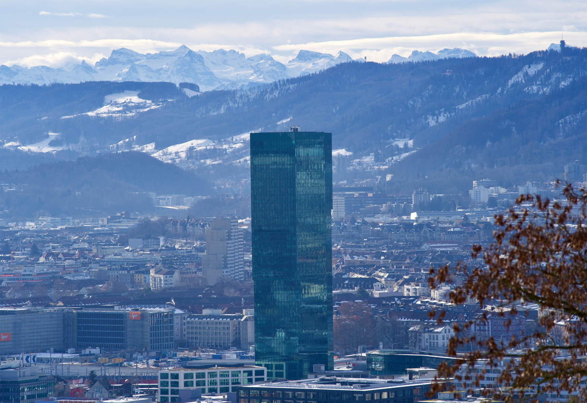
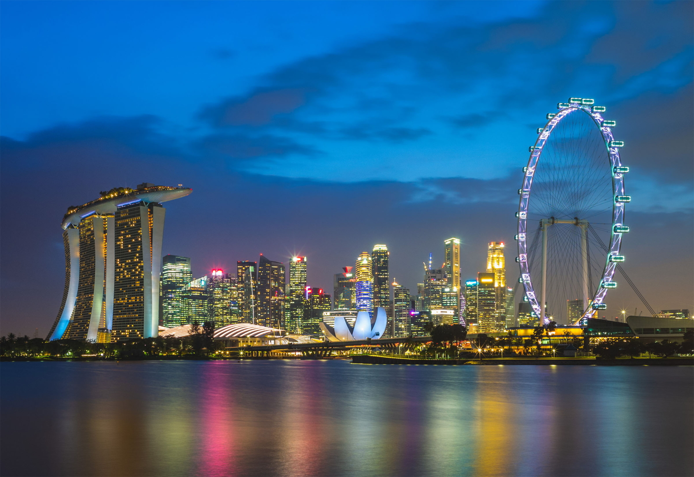
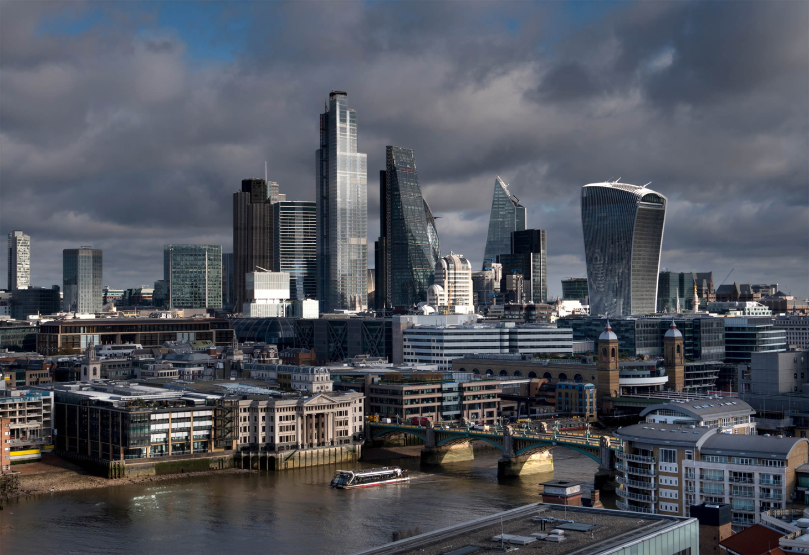
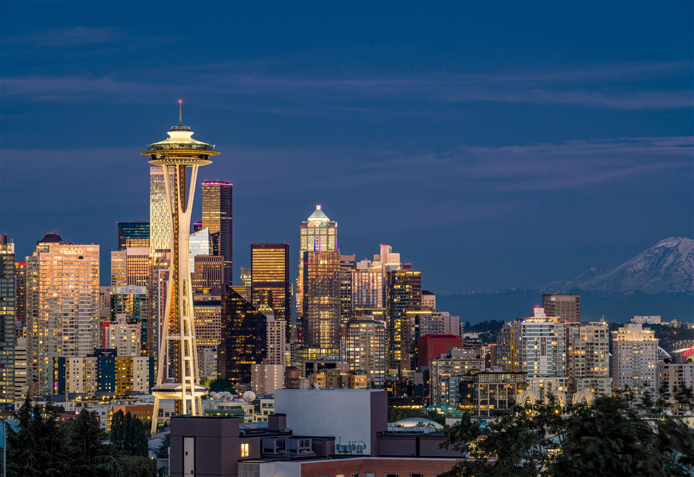
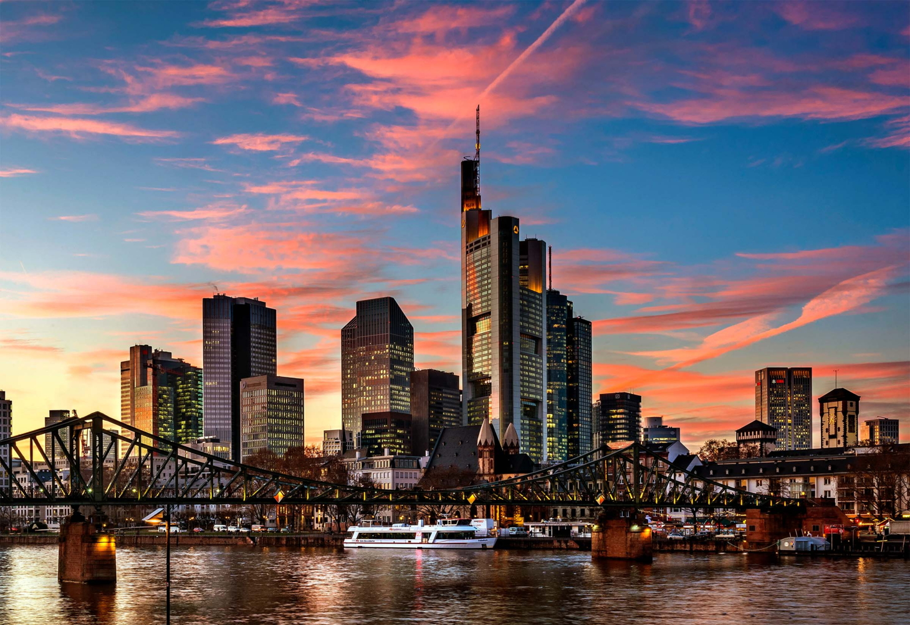
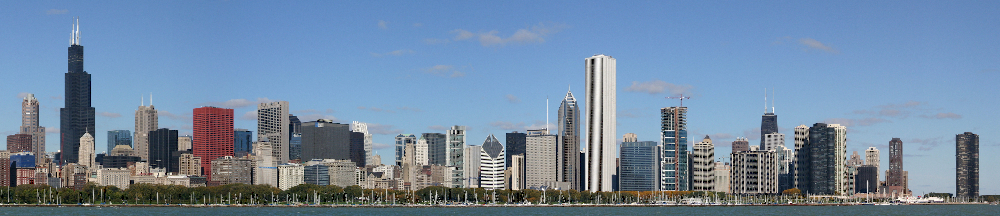
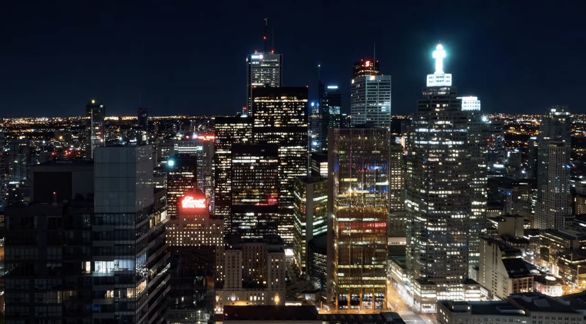

# Lightbox

Screenshots, diagrams, and data visualizations carry most of the weight in technical documentation, yet readers usually see them shrunk to fit the column width. The Great Docs lightbox lets any image expand into a focused, full-screen view with zoom, panning, galleries, captions, dark-mode variants, annotations, before/after comparison, and a copy/download toolbar.

## Quick Start

Add the `.lightbox` class to any image to make it clickable:

```markdown
{.lightbox}
```

{.lightbox}

Click the image to open it. Press `Escape`, click the backdrop, or use the close button to dismiss it. That single class is all you need; everything else on this page is optional enhancement.

## Turning the Lightbox On

You control which images become interactive at two levels: per image, or per page.

The per-image approach is opt-in. Add `.lightbox` to the images you want to enlarge, and leave the rest as static figures:

```markdown
{.lightbox}


```

The per-page approach is opt-out. Set `lightbox: true` (or `lightbox: auto`) in the page frontmatter to enlarge every block-level image automatically, including images produced by executable code cells:

```yaml
---
title: "My Page"
lightbox: auto
---
```

In auto mode, exclude individual images with the `.nolightbox` class:

```markdown
{.nolightbox}
```

:::{.callout-note}
The lightbox assets load automatically on every Great Docs site. There is nothing to install or enable in `great-docs.yml`; the `.lightbox` class and the `lightbox` frontmatter key work out of the box.
:::

## Captions and Credits

A caption appears beneath the enlarged image, and a credit line attributes the source. When you omit `caption`, the lightbox falls back to the image's alt text.

```markdown
{.lightbox
  caption="The Singapore skyline along Marina Bay"
  credit="Photo via Pexels"}
```

{.lightbox caption="The Singapore skyline along Marina Bay" credit="Photo via Pexels"}

Write alt text for accessibility regardless of whether you set a caption. The alt text also becomes the screen-reader label for the enlarged view and the default download filename.

## Dark-Mode Image Variants

When your site supports dark mode, a bright daytime photo can look harsh against a dark backdrop. The lightbox can swap to a dark-optimized image automatically, but only when you opt in. Images without a declared dark variant keep their original source in both themes, so nothing ever breaks.

There are two ways to opt in. The first is an explicit `dark` attribute pointing at the alternate file:

```markdown
{.lightbox
  dark="../assets/city-toronto-nighttime.png"
  caption="Toggle the site theme to watch day turn to night"}
```

{.lightbox dark="../assets/city-toronto-nighttime.png" caption="Toggle the site theme to watch day turn to night"}

The second is a naming convention. If your source file is named with a `.light` segment, the lightbox looks for a matching `.dark` sibling:

```markdown
{.lightbox}
```

With that markup, a dark-mode reader sees `city-toronto.dark.png` while a light-mode reader sees `city-toronto.light.png`. Both the page thumbnail and the enlarged view follow the active theme, and the swap happens live when the reader toggles themes.

:::{.callout-warning}
The naming convention only triggers on the `.light` opt-in. A plain `skyline.png` will not silently look for `skyline.dark.png`, because that guessed file usually does not exist and would produce a broken image in the enlarged view.
:::

## Galleries

Give several images the same `group` value to bind them into a gallery. Opening any one of them lets the reader page through the whole set with arrows, a filmstrip, keyboard keys, and touch swipes.

```markdown
{.lightbox group="cities" caption="London"}

{.lightbox group="cities" caption="Shanghai"}

{.lightbox group="cities" caption="Seattle"}

{.lightbox group="cities" caption="Frankfurt"}

{.lightbox group="cities" caption="Taipei"}
```

{.lightbox group="cities" caption="London"}

{.lightbox group="cities" caption="Shanghai"}

{.lightbox group="cities" caption="Seattle"}

{.lightbox group="cities" caption="Frankfurt"}

{.lightbox group="cities" caption="Taipei"}

A counter shows your position in the set, and a filmstrip at the bottom lets readers jump directly to any image.

### Navigation

Within a gallery, readers move between images using several input methods:

| Input            | Action                          |
| ---------------- | ------------------------------- |
| Arrow buttons    | Previous / next image           |
| `ArrowLeft` / `ArrowRight` | Previous / next image |
| Filmstrip thumb  | Jump to a specific image        |
| Swipe left/right | Previous / next (touch devices) |
| Swipe down       | Close the lightbox (touch)      |

### Looping and Autoplay

By default a gallery wraps around: paging past the last image returns to the first. Set `loop="false"` to stop at the ends instead, which also disables the navigation arrows at the first and last image:

```markdown
{.lightbox group="steps" loop="false"}
{.lightbox group="steps" loop="false"}
```

To advance the gallery automatically, add an `autoplay` interval. The value accepts seconds (`3s`), milliseconds (`2000ms`), or a bare number:

```markdown
{.lightbox group="reel" autoplay="4s"}
{.lightbox group="reel" autoplay="4s"}
{.lightbox group="reel" autoplay="4s"}
```

Manual navigation resets the autoplay timer, so a reader who takes control is not interrupted mid-view.

## Gallery Stack

A long gallery laid out inline takes a lot of vertical space. The `.lightbox-gallery` fenced div collapses a set of images into a single framed cover with a stacked-photo effect and a count badge. It occupies a fixed, compact footprint in the page, and clicking it opens the whole set as a gallery in the lightbox.

```markdown
::: {.lightbox-gallery}
{caption="Singapore"}
{caption="Hong Kong"}
{caption="Zurich"}
{caption="Florence"}
{caption="Warsaw"}
:::
```

::: {.lightbox-gallery}
{caption="Singapore"}
{caption="Hong Kong"}
{caption="Zurich"}
{caption="Florence"}
{caption="Warsaw"}
:::

The first image becomes the visible cover; the rest are bound into the same gallery behind it. Each image keeps its own `caption`, and once open, the full set of controls (filmstrip, arrows, autoplay, zoom) works as usual.

Constrain the footprint with a `width` attribute on the div:

```markdown
::: {.lightbox-gallery width="360px"}
{caption="Singapore"}
{caption="Hong Kong"}
:::
```

## Zooming and Panning

Every enlarged image can be magnified with the toolbar zoom controls. The toolbar shows a zoom-out button, the current zoom level, a zoom-in button, and a reset-to-fit button.

Readers have these zoom options:

| Input            | Action                  |
| ---------------- | ----------------------- |
| Zoom buttons     | Step in, out, or reset  |
| `+` / `-` keys   | Zoom in / out           |
| `0` key          | Reset to fit (100%)     |
| Drag             | Pan the magnified image |

Zoom runs from 100% up to 400% in steps. Once you pass 100%, the cursor becomes a grab hand and you can drag to pan around the image; the pan is clamped so the image always covers the frame. Annotation markers (covered next) hide while an image is zoomed to keep the view clean, and reappear when you reset.

## The Toolbar

The toolbar that floats over the enlarged image carries three actions beyond zoom and close. It fades away after a few seconds of inactivity and returns on mouse movement.

The actions are:

- **Copy image** places the picture on your clipboard. The image is rasterized to PNG first, so it pastes into editors and chat apps even when the source is an SVG.
- **Download image** saves the picture, using the alt text as the suggested filename.
- **Copy link** copies a deep link that reopens the lightbox on this exact image (see below).

:::{.callout-note}
Copy image works for same-origin images. If you load images from a CDN without cross-origin headers, the browser blocks the canvas read; the lightbox then falls back to copying the image URL as text.
:::

## Deep Linking

When a reader opens an image, the page URL gains a `#lightbox=` fragment that identifies it. Sharing that URL, or clicking the toolbar's copy-link button, reopens the page with that image already enlarged. This is useful for pointing a colleague at one specific screenshot or gallery frame.

```markdown
See the [Chicago skyline up close](my-page.html#lightbox=gd-lb-3).
```

Identifiers are assigned in document order as `gd-lb-1`, `gd-lb-2`, and so on. The copy-link button is the reliable way to capture the correct identifier without counting images by hand.

## Image Annotations

Annotations overlay numbered markers on an image, each revealing a tooltip on hover or click. They render both on the page thumbnail and inside the enlarged view, so a reader can study a labeled scene at full size. Provide them as a JSON array in the `annotations` attribute.

```markdown
{.lightbox
  caption="Landmark towers of the Chicago skyline"
  annotations='[
    {"x": 7,  "y": 28, "label": "1", "text": "Willis Tower"},
    {"x": 13, "y": 48, "label": "2", "text": "Chicago Board of Trade Building"},
    {"x": 22, "y": 52, "label": "3", "text": "CNA Center"},
    {"x": 60, "y": 28, "label": "4", "text": "Aon Center"},
    {"x": 78, "y": 42, "label": "5", "text": "John Hancock Center"},
    {"x": 95, "y": 54, "label": "6", "text": "Lake Point Tower"}
  ]'}
```

{.lightbox caption="Landmark towers of the Chicago skyline" annotations='[{"x": 7, "y": 28, "label": "1", "text": "Willis Tower"}, {"x": 13, "y": 48, "label": "2", "text": "Chicago Board of Trade Building"}, {"x": 22, "y": 52, "label": "3", "text": "CNA Center"}, {"x": 60, "y": 28, "label": "4", "text": "Aon Center"}, {"x": 78, "y": 42, "label": "5", "text": "John Hancock Center"}, {"x": 95, "y": 54, "label": "6", "text": "Lake Point Tower"}]'}

Each annotation object accepts the following keys:

| Key     | Required | Description                                            |
| ------- | -------- | ------------------------------------------------------ |
| `x`     | yes      | Horizontal position as a percentage (0 to 100)         |
| `y`     | yes      | Vertical position as a percentage (0 to 100)           |
| `label` | no       | Short text inside the marker (defaults to its number)  |
| `text`  | no       | Tooltip body shown on hover or click                   |
| `color` | no       | Marker color override (any CSS color)                  |

Positions are percentages relative to the image, so markers stay anchored to the same spot whether the image is shown as a thumbnail or enlarged. Keep label text short, one or two characters, and put the detail in `text`.

## Before/After Comparison

A comparison slider stacks two images and reveals one or the other as the reader drags a divider. It is ideal for showing a day/night pairing, a redesign, or the effect of a configuration change. Use the `compare` shortcode:

```markdown

```



The shortcode accepts these attributes:

| Attribute      | Default      | Description                              |
| -------------- | ------------ | ---------------------------------------- |
| `before`       |              | First (left or top) image path           |
| `after`        |              | Second (right or bottom) image path      |
| `label-before` | `Before`     | Caption for the first image              |
| `label-after`  | `After`      | Caption for the second image             |
| `direction`    | `horizontal` | Split orientation: `horizontal` or `vertical` |
| `start`        | `50`         | Initial divider position, as a percentage |

If you prefer Markdown over a shortcode, a fenced div with the `.lightbox-compare` class and two images works the same way, taking labels from each image's `caption` attribute:

```markdown
::: {.lightbox-compare direction="vertical" start="40"}
{caption="Day"}
{caption="Night"}
:::
```

## Responsive Images

For large images, you can serve a smaller file inline and a sharper one in the enlarged view. The `srcset` and `sizes` attributes follow the standard HTML responsive-image syntax, and the lightbox automatically uses the highest-resolution entry when it opens:

```markdown
{.lightbox
  srcset="../assets/city-hong-kong-800.jpg 800w, ../assets/city-hong-kong-1600.jpg 1600w"
  sizes="(max-width: 768px) 100vw, 800px"}
```

When you want to control the enlarged source directly, set `full-src` to the image the lightbox should display, independent of what appears inline:

```markdown
{.lightbox full-src="../assets/city-shanghai-full.jpg"}
```

## Accessibility

The lightbox is built to work with keyboards and assistive technology, and to respect motion preferences.

- Opening an image moves focus into the dialog, and focus is trapped there until the lightbox closes, at which point it returns to the image you came from.
- The overlay is a labeled modal dialog, navigation is fully keyboard-operable, and slide changes are announced to screen readers.
- The origin-zoom open animation and gallery transitions respect `prefers-reduced-motion: reduce`.

:::{.callout-tip}
The lightbox manages its own zoom, so the browser's pinch-to-zoom is not needed inside the overlay. Use the toolbar controls or the `+`, `-`, and `0` keys for predictable, image-only magnification.
:::

## Attribute Reference

The following attributes apply to any image with the `.lightbox` class (or any image in a page using `lightbox: auto`). All are optional.

| Attribute     | Description                                                        |
| ------------- | ----------------------------------------------------------------- |
| `caption`     | Caption shown beneath the enlarged image                          |
| `credit`      | Attribution line shown below the caption                          |
| `dark`        | Path to a dark-mode image variant                                 |
| `group`       | Gallery name; images sharing a value navigate together            |
| `loop`        | Set `false` to stop gallery paging at the ends                    |
| `autoplay`    | Auto-advance interval, e.g. `3s`, `2000ms`, or a number           |
| `annotations` | JSON array of marker objects (`x`, `y`, `label`, `text`, `color`) |
| `srcset`      | Responsive source set; the widest entry is used when enlarged     |
| `sizes`       | Responsive sizes hint paired with `srcset`                        |
| `full-src`    | Explicit high-resolution source for the enlarged view             |

The two classes that control participation are `.lightbox` (opt in) and `.nolightbox` (opt out in auto mode).

## Next Steps

The lightbox turns ordinary figures into an explorable, shareable part of your documentation, from a single click-to-zoom screenshot to annotated galleries and before/after sliders. Reach for it whenever a reader would benefit from seeing an image larger or in more detail.

- [Authoring QMD Files](03-authoring-qmd-files.qmd): how images and figures fit into page content
- [Theming](11-theming.qmd): accent colors that the lightbox and annotation markers inherit
- [Diagrams](19-diagrams.qmd): pair Mermaid and other diagrams with the lightbox for detailed inspection
- [Collapsible Details](40-collapsible-details.qmd): another interactive content block with a similar attribute syntax
